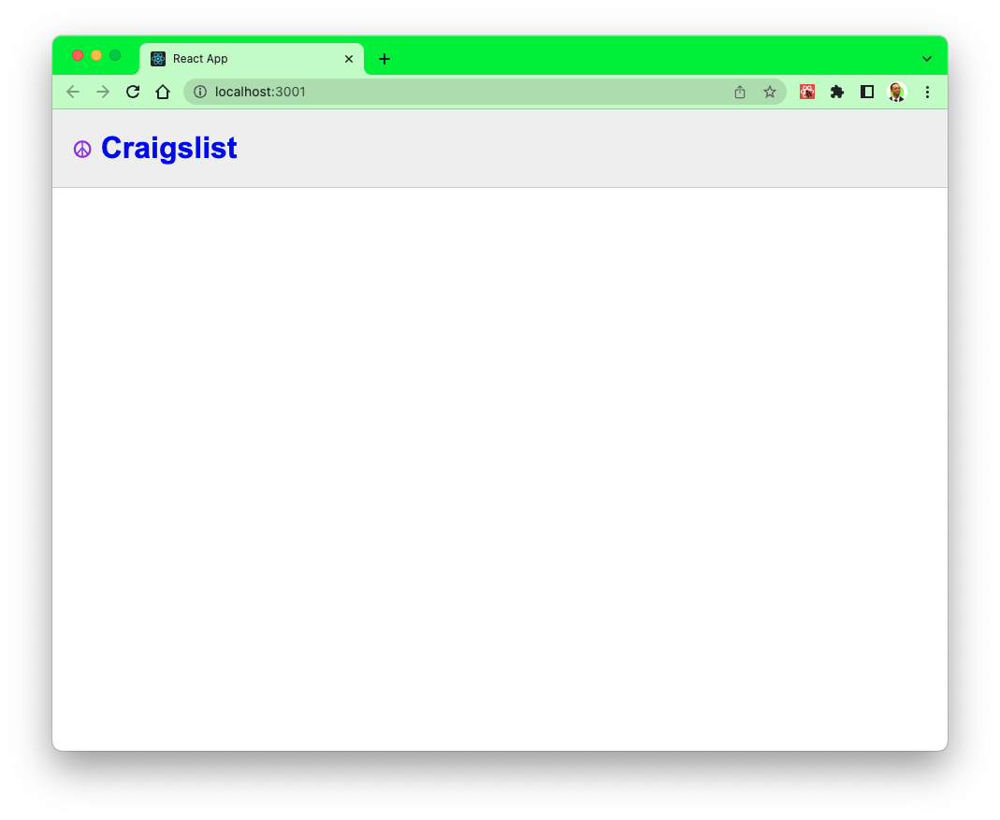

# Craigslist Mock App

 Hey everyone! Welcome to the Web Development Bootcamp.
Over the few weeks, we'll be using what we learned from previous lessons on using HTML, CSS, and JavaScript and now incorporating React Framework to create a Craigslist Mock App.

Learning Goals:
- React fundementals
- Components & props
- JSX
- Managing state
- Handle events(Submit)
- Forms
- Hooks
### ⚒️ Tech Stack: HTML, CSS and React

 

# Session 01: App progress

- We got the data to log in the console
- We created a Header.js and listingCaontainer.js components

# How to get started

Use the starter code folder to grab the basic HTML, CSS template and get started with building the tasks from Session 01 Readme file.
 
As a reference, you can take a look at the code after the end of each session.
 

# User Stories:
- npx create-react-app
- install npm json server
- create db.json file add the keys value pairs, e.g, id, description, image, location, price
- fetch listings & console.log the data.

# branch details:
- main branch | has the fetch function & data retrieveal some basic css
- session-2 branch | renders child components, like functionality, delete funcntion using DELETE network request, and more css.
- session-3 branch | search feature, bonus sorting feature by object id or by location, and more css. 
- development branch | has everything. 

### 🚀 Resources

- W3Schools React - [Link Here ➡️](https://www.w3schools.com/REACT/DEFAULT.ASP)
- NPM Json Server - [Link Here ➡️](https://www.npmjs.com/package/json-server)
- MDN JSON Format - [Link Here ➡️](<https://developer.mozilla.org/en-US/docs/Learn/JavaScript/Objects/JSON#:~:text=JavaScript%20Object%20Notation%20(JSON)%20is,page%2C%20or%20vice%20versa>)
- MDN React Hooks - [Link Here ➡️](https://www.w3schools.com/REACT/react_hooks.asp)
- VScode ES7/React snippet - [Link Here ➡️](https://marketplace.visualstudio.com/items?itemName=dsznajder.es7-react-js-snippets)

This project was bootstrapped with [Create React App](https://github.com/facebook/create-react-app).

## Available Scripts

In the project directory, you can run:

### `npm start`

Runs the app in the development mode.\
Open [http://localhost:3000](http://localhost:3000) to view it in your browser.

The page will reload when you make changes.\
You may also see any lint errors in the console.

### `npm test`

Launches the test runner in the interactive watch mode.\
See the section about [running tests](https://facebook.github.io/create-react-app/docs/running-tests) for more information.

### `npm run build`

Builds the app for production to the `build` folder.\
It correctly bundles React in production mode and optimizes the build for the best performance.

The build is minified and the filenames include the hashes.\
Your app is ready to be deployed!

See the section about [deployment](https://facebook.github.io/create-react-app/docs/deployment) for more information.

### `npm run eject`

**Note: this is a one-way operation. Once you `eject`, you can't go back!**

If you aren't satisfied with the build tool and configuration choices, you can `eject` at any time. This command will remove the single build dependency from your project.

Instead, it will copy all the configuration files and the transitive dependencies (webpack, Babel, ESLint, etc) right into your project so you have full control over them. All of the commands except `eject` will still work, but they will point to the copied scripts so you can tweak them. At this point you're on your own.

You don't have to ever use `eject`. The curated feature set is suitable for small and middle deployments, and you shouldn't feel obligated to use this feature. However we understand that this tool wouldn't be useful if you couldn't customize it when you are ready for it.

## Learn More

You can learn more in the [Create React App documentation](https://facebook.github.io/create-react-app/docs/getting-started).

To learn React, check out the [React documentation](https://reactjs.org/).

### Code Splitting

This section has moved here: [https://facebook.github.io/create-react-app/docs/code-splitting](https://facebook.github.io/create-react-app/docs/code-splitting)

### Analyzing the Bundle Size

This section has moved here: [https://facebook.github.io/create-react-app/docs/analyzing-the-bundle-size](https://facebook.github.io/create-react-app/docs/analyzing-the-bundle-size)

### Making a Progressive Web App

This section has moved here: [https://facebook.github.io/create-react-app/docs/making-a-progressive-web-app](https://facebook.github.io/create-react-app/docs/making-a-progressive-web-app)

### Advanced Configuration

This section has moved here: [https://facebook.github.io/create-react-app/docs/advanced-configuration](https://facebook.github.io/create-react-app/docs/advanced-configuration)

### Deployment

This section has moved here: [https://facebook.github.io/create-react-app/docs/deployment](https://facebook.github.io/create-react-app/docs/deployment)

### `npm run build` fails to minify

This section has moved here: [https://facebook.github.io/create-react-app/docs/troubleshooting#npm-run-build-fails-to-minify](https://facebook.github.io/create-react-app/docs/troubleshooting#npm-run-build-fails-to-minify)
