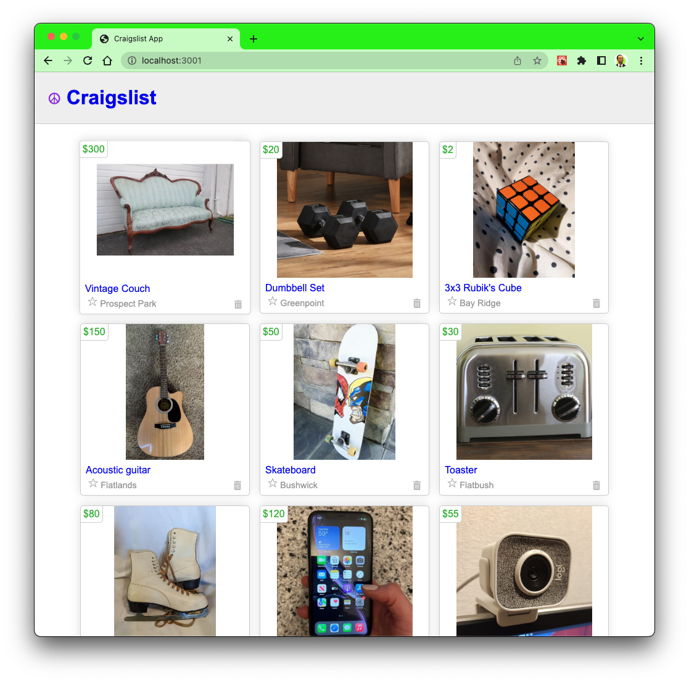

# Craigslist Mock App

 Hey everyone! Welcome to the Web Development Bootcamp.
Over the few weeks, we'll be using what we learned from previous lessons on using HTML, CSS, and JavaScript and now incorporating React Framework to create a Craigslist Mock App.

Learning Goals:
- React fundementals
- Components & props
- JSX
- Managing state
- Handle events(Submit)
- Forms
- Hooks
### ⚒️ Tech Stack: HTML, CSS and React

 

# Session 02: App progress

- The listings.map function is used to create an array of ListingCard components by iterating over the listings array and transforming each listing object into a ListingCard component with the key, listing, and onDeleteListing props. The resulting listingCards array is then rendered in the JSX returned from the ListingContainer component using curly braces and the div element.
- In a RESTful API that follows the CRUD architecture, deleting a resource typically involves sending a DELETE request to the resource's URL, which usually includes the resource's ID as a parameter or in the URL path. In the case of the JSON server, the URL for deleting a specific listing would be something like http://localhost:3000/listings/:id, where :id is the ID of the listing to be deleted. When a successful DELETE request is made to this endpoint, the JSON server will respond with an empty object {} indicating that the resource has been successfully deleted from the server. You can use this response to confirm that the resource has been deleted and update the state of your application accordingly.
- In ListingContainer component we created a handleDelete function to remove a listing with a particular ID from an array of listings, we created a new array that excludes the listing with the given ID using the filter method. Then, update the state of the listings array using the setListings function to trigger a re-render with the updated array.
- By passing a reference to the onDeleteListing function as a prop to the child ListingCard component and calling it with the ID of the listing that was successfully deleted, the parent ListingContainer component can access the ID of the deleted listing and perform any necessary updates to the state of the listings array or other components. In this way, the onDeleteListing function serves as a callback that allows the child ListingCard component to communicate with its parent ListingContainer component and pass data from the child to the parent.

# How to get started

Use the starter code folder to grab the basic HTML, CSS template and get started with building the tasks from Session 01 Readme file.
 
As a reference, you can take a look at the code after the end of each session.
 

# User Stories:
- npx create-react-app
- install npm json server
- create db.json file add the keys value pairs, e.g, id, description, image, location, price
- fetch listings & console.log the data.
- refer to session 01 to continue...

### 🚀 Resources

- RadicalX Web Dev Bootcamp for video resources and interacting with the community: [Link Here ➡️](https://www.community.radicalx.co/spaces/8972871/content)
- W3Schools React - [Link Here ➡️](https://www.w3schools.com/REACT/DEFAULT.ASP)
- NPM Json Server - [Link Here ➡️](https://www.npmjs.com/package/json-server)
- MDN JSON Format - [Link Here ➡️](<https://developer.mozilla.org/en-US/docs/Learn/JavaScript/Objects/JSON#:~:text=JavaScript%20Object%20Notation%20(JSON)%20is,page%2C%20or%20vice%20versa>)
- MDN React Hooks - [Link Here ➡️](https://www.w3schools.com/REACT/react_hooks.asp)
- VScode ES7/React snippet - [Link Here ➡️](https://marketplace.visualstudio.com/items?itemName=dsznajder.es7-react-js-snippets)

This project was bootstrapped with [Create React App](https://github.com/facebook/create-react-app).

## Available Scripts

In the project directory, you can run:

### `npm start`

Runs the app in the development mode.\
Open [http://localhost:3000](http://localhost:3000) to view it in your browser.

The page will reload when you make changes.\
You may also see any lint errors in the console.

### `npm test`

Launches the test runner in the interactive watch mode.\
See the section about [running tests](https://facebook.github.io/create-react-app/docs/running-tests) for more information.

### `npm run build`

Builds the app for production to the `build` folder.\
It correctly bundles React in production mode and optimizes the build for the best performance.

The build is minified and the filenames include the hashes.\
Your app is ready to be deployed!

See the section about [deployment](https://facebook.github.io/create-react-app/docs/deployment) for more information.

### `npm run eject`

**Note: this is a one-way operation. Once you `eject`, you can't go back!**

If you aren't satisfied with the build tool and configuration choices, you can `eject` at any time. This command will remove the single build dependency from your project.

Instead, it will copy all the configuration files and the transitive dependencies (webpack, Babel, ESLint, etc) right into your project so you have full control over them. All of the commands except `eject` will still work, but they will point to the copied scripts so you can tweak them. At this point you're on your own.

You don't have to ever use `eject`. The curated feature set is suitable for small and middle deployments, and you shouldn't feel obligated to use this feature. However we understand that this tool wouldn't be useful if you couldn't customize it when you are ready for it.

## Learn More

You can learn more in the [Create React App documentation](https://facebook.github.io/create-react-app/docs/getting-started).

To learn React, check out the [React documentation](https://reactjs.org/).

### Code Splitting

This section has moved here: [https://facebook.github.io/create-react-app/docs/code-splitting](https://facebook.github.io/create-react-app/docs/code-splitting)

### Analyzing the Bundle Size

This section has moved here: [https://facebook.github.io/create-react-app/docs/analyzing-the-bundle-size](https://facebook.github.io/create-react-app/docs/analyzing-the-bundle-size)

### Making a Progressive Web App

This section has moved here: [https://facebook.github.io/create-react-app/docs/making-a-progressive-web-app](https://facebook.github.io/create-react-app/docs/making-a-progressive-web-app)

### Advanced Configuration

This section has moved here: [https://facebook.github.io/create-react-app/docs/advanced-configuration](https://facebook.github.io/create-react-app/docs/advanced-configuration)

### Deployment

This section has moved here: [https://facebook.github.io/create-react-app/docs/deployment](https://facebook.github.io/create-react-app/docs/deployment)

### `npm run build` fails to minify

This section has moved here: [https://facebook.github.io/create-react-app/docs/troubleshooting#npm-run-build-fails-to-minify](https://facebook.github.io/create-react-app/docs/troubleshooting#npm-run-build-fails-to-minify)
